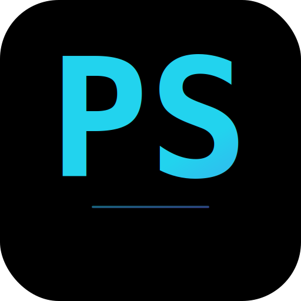

<p align="center">
  <picture>
    <source media="(prefers-color-scheme: dark)" srcset="public/icon.svg">
    
  </picture>
</p>

<h1 align="center">🛸 Portifolio Samuel</h1>

<p align="center">
  <strong>Portfólio profissional · Next.js · React · TypeScript</strong>
</p>

<p align="center">
  <a href="https://samuelmedeiros.vercel.app">
    
  </a>
  <a href="#-testes">
    
  </a>
  <a href="https://github.com/Samuelfmedeiros/Portifolio/actions">
    
  </a>
  <a href="https://github.com/Samuelfmedeiros/Portifolio/blob/master/LICENSE">
    
  </a>
  <br />
  
  
  
  
  
  
</p>

---

## Sobre

Portfólio profissional de **Samuel Medeiros** — desenvolvedor full stack e analista de dados. Fog do padrão "currículo bonitinho": cada seção é um módulo independente que demonstra habilidades reais em arquitetura de software, animações de ponta, qualidade de código e experiência do usuário.

→ **[samuelmedeiros.vercel.app](https://samuelmedeiros.vercel.app)**

### O que você encontra aqui

- **Arquitetura Next.js 16** — App Router, server components, API routes, Turbopack
- **Design system próprio** — tema escuro ciano+preto, glassmorphism, tipografia consistente (dark/light + 6 paletas)
- **Animações cinematográficas** — Framer Motion com spring physics, parallax multicamada
- **Qualidade industrial** — 219 testes, CI/CD, CSP, acessibilidade (95+), SEO (100)
- **5 mini-games embutidos** — React no navegador, zero dependência externa
- **i18n PT/EN** — completo em todos os componentes
- **Terminal interativo** — 15+ comandos simulando um ambiente real
- **Analytics** — Umami self-hosted (eventos + pageviews)

---

## Stack

| Categoria | Tecnologia |
|-----------|-----------|
| **Framework** | Next.js 16 (App Router + Turbopack) |
| **Linguagem** | TypeScript 5 |
| **Estilização** | Tailwind CSS 4 |
| **Animações** | Framer Motion |
| **Ícones** | Lucide React |
| **Backend** | Capivara API (PostgreSQL 18 local) |
| **Testes** | Vitest + Testing Library + Playwright |
| **CI/CD** | GitHub Actions → Vercel |
| **Analytics** | Umami self-hosted |

---

## Seções

| Seção | Componente | Destaque |
|-------|-----------|----------|
| **Hero** | `HeroSection.tsx` | TypeWriter, parallax L0-L3, cockpit SVG |
| **Profile** | `ProfileSection.tsx` | Timeline interativa, Skills grid com barra |
| **Projetos** | `ProjectHangar.tsx` | Grid filtrável, dados GitHub + fallback estático |
| **Jogos** | `GameShowcase.tsx` | 5 jogos em iframe, React via CDN |
| **Contato** | `ContactForm.tsx` | Validação, rate-limit, LGPD, Capivara API |
| **Terminal** | `Terminal.tsx` | 15+ comandos interativos |

---

## Começando

```bash
# Clone
git clone https://github.com/Samuelfmedeiros/portifolio.git
cd portifolio

# Instalar dependências (pnpm obrigatório)
pnpm install

# Dev server
pnpm dev

# Build
pnpm build

# Testes
pnpm test:run
pnpm test:e2e
```

**Pré-requisitos:** Node.js 22+, pnpm 9+

---

## Scripts

| Comando | Descrição |
|---------|-----------|
| `pnpm dev` | Dev server (Turbopack) |
| `pnpm build` | Build produção |
| `pnpm build:analyze` | Build com análise de bundle |
| `pnpm test` | Vitest watch mode |
| `pnpm test:run` | Vitest (uma vez) |
| `pnpm test:e2e` | Playwright E2E |
| `pnpm lint` | ESLint check |
| `pnpm lint:fix` | ESLint auto-fix |

---

## Testes

**219 testes passando** — cobertura de:
- Todos os 45 componentes
- Hooks (useLocalStorage, useAnalytics)
- Libs (GitHub API, staticProjects, Capivara API)
- 5 jogos (GameShowcase)
- 8 E2E smoke tests (Playwright contra produção)

```bash
pnpm test:run    # Vitest
pnpm test:e2e    # Playwright
```

---

## Documentação

| Arquivo | Conteúdo |
|---------|----------|
| [AGENTS.md](./AGENTS.md) | Estado atual do projeto + diretrizes de design |
| [DEPLOY.md](./DEPLOY.md) | Deploy automático + manual + troubleshooting |
| [SECURITY.md](./SECURITY.md) | Política de segurança + headers + auditoria |
| [docs/ARCHITECTURE.md](./docs/ARCHITECTURE.md) | Stack, seções, performance |
| [docs/HISTORY.md](./docs/HISTORY.md) | História completa do projeto |
| [docs/STRIPE_PORTIFOLIO.md](./docs/STRIPE_PORTIFOLIO.md) | Integração Stripe (consultoria) |

---

## Licença

MIT © Samuel Medeiros
